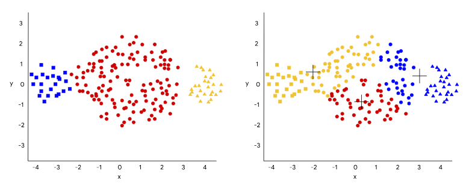

<h1>K-means algorithm</h1>

Kmeans algorithm is an iterative algorithm that tries to partition 
the dataset into Kpre-defined distinct non-overlapping subgroups 
(clusters) where each data point belongs to only one group. 
It tries to make the intra-cluster data points as similar as 
possible while also keeping the clusters as different (far) as possible.
It assigns data points to a cluster such that the sum of the squared
distance between the data points and the cluster’s centroid 
(arithmetic mean of all the data points that belong to that cluster)
is at the minimum. The less variation we have within clusters,
the more homogeneous (similar) the data points are within the 
same cluster.

 

<ol>
<li>Specify number of clusters K.</li>

<li>
Initialize centroids by first shuffling the dataset and then randomly selecting K 
data points for the centroids without replacement.
</li>

<li>
Keep iterating until there is no change to the centroids. i.e 
assignment of data points to clusters isn’t changing.
</li>
</ol>

<ul>
<li>
Compute the sum of the squared distance between data points 
and all centroids.
</li>

<li>Assign each data point to the closest cluster (centroid).</li>

<li>
Compute the centroids for the clusters by taking the average of the all data 
points that belong to each cluster.
</li>
</ul>

